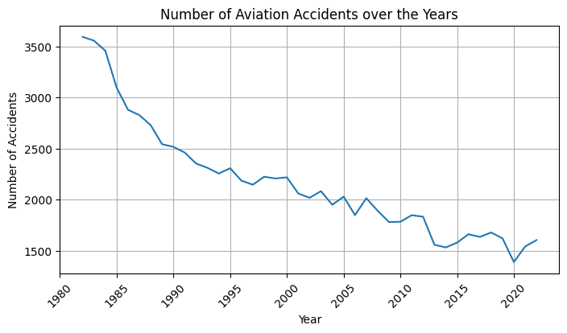
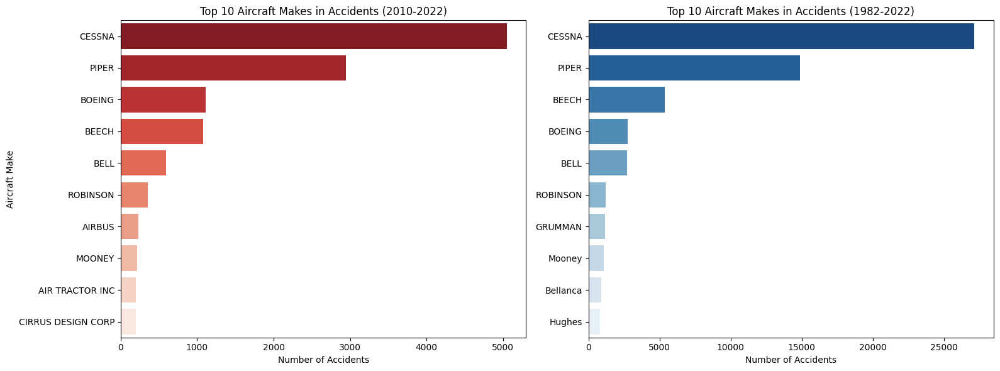

# Aviation Accident Analysis Dashboard

## Project Overview

This project analyzes aviation accidents to identify high-risk aircraft for a company considering investing in aviation. It explores accident trends, aircraft makes, weather conditions, flight purposes, and other factors to provide data-driven business recommendations.

## Business Problem

Your company is expanding into new industries to diversify its portfolio. Specifically, they are interested in purchasing and operating airplanes for commercial and private enterprises but lack knowledge of the potential risks associated with different aircraft.

You have been tasked with:

- Identifying the safest aircraft types
- Highlighting key accident factors
- Translating findings into actionable insights for the head of the new aviation division

## The Data

The dataset comes from the National Transportation Safety Board (NTSB) and includes aviation accident data from 1962 to 2023. It contains 88,889 records on civil aviation accidents and selected incidents in the United States and international waters.

### Key Columns Used:
- **Event.Date** – Date of the accident
- **Injury.Severity** – Severity of injuries
- **Aircraft.Damage** – Extent of aircraft damage
- **Make** - Aircraft manufacturer
- **Model** – Aircraft model
- **Number.of.Engines** – Engine count in the aircraft
- **Engine.Type** – Type of engine
- **Purpose.of.Flight** – Flight purpose (e.g., business, commercial, personal)
- **Total.Fatal.Injuries** – Number of fatalities
- **Total.Serious.Injuries** – Number of serious injuries
- **Total.Minor.Injuries** – Number of minor injuries
- **Total.Uninjured** – Number of uninjured passengers
- **Weather.Condition** – Weather conditions at the time of the accident

## Key Features & Insights

The dashboard provides insights into factors influencing aviation accidents and business decision-making.

### Key Visuals:
- Accident Trends Over Time – Historical analysis of accident occurrences
- High-Risk Aircraft Makes & Features – Identifying the riskiest aircraft manufacturers
- Weather Impact on Accidents – Analyzing the role of weather conditions in accidents
- Flight Purpose Risks – Comparing accident rates by flight purpose (commercial, private, etc.)





## Technologies & Tools Used

- **Programming Language**: Python
- **Libraries:** pandas, seaborn, matplotlib, numpy
- **BI Tool:** Tableau - [My Dashboard](https://public.tableau.com/views/AviationData_17389465595370/AviationAccident?:language=en-GB&:sid=&:redirect=auth&:display_count=n&:origin=viz_share_link)

## Business Recommendations

- **Investment Strategy:** Avoid investing in aircraft models with high accident rates.
- **Fleet Selection:** Prioritize aircraft with fewer casualties, numerous engines, and better safety records.
- **Prioritize safer business models:** Invest in aircraft activities with lower accident risk, instead of high-risk operations.


## Folder Structure

```python
phase_1_project/
│── student.pdf        # PDF of VS Code Notebook
│── presentation.pdf        # Non-technical presentation slides
│── dashboard.pdf        # PDF version of the Tableau dashboard
│── README.md        # Project documentation
```

## Future Work

- Conduct deeper analysis on accident causes.
- Investigate insurance costs and regulations.
- Develop a risk assessment framework for future investments.
- Expand analysis to global accident datasets for broader insights.

